# Codex1 Rebuild Clear Architecture

Status: source-of-truth design draft for a from-scratch rebuild  
Audience: an AI coding agent implementing Codex1 without needing hidden chat context  
Primary warning: do not turn this into a fake-permission runtime or a giant state machine

## 0. Read This First

This document describes the intended Codex1 rebuild.

It is deliberately explicit because a vague design causes AI agents to invent missing machinery. If an instruction below says a reviewer "must not edit files," that does **not** mean "build a sandbox, token system, or caller-identity detector." It means "spawn reviewers with clear reviewer developer instructions and reviewer prompts." The CLI validates mission artifacts and state transitions; it does not police AI role identity.

The most important implementation principle:

```text
Codex1 should make Codex better at working natively.
Codex1 should not rebuild Codex from the outside.
```

The intended product shape:

```text
Skills-first UX
+ small deterministic CLI
+ visible mission files
+ DAG plans
+ derived execution waves
+ normal subagents
+ tiny Ralph stop guard
```

Do not build:

```text
hidden wrapper runtime
fake parent/subagent security
session identity maze
reviewer writeback capability tokens
stored wave truth
many overlapping gate/cache/closeout files
Ralph as an orchestrator
```

The clean mental model:

```text
The main Codex thread uses skills.
Skills use the codex1 CLI.
The CLI stores and validates mission truth.
Subagents are normal Codex subagents with clear role prompts.
Reviewers return findings to the main thread.
The main thread records review results.
Ralph only asks codex1 status whether stop is allowed.
```

## 1. North Star

Codex1 exists so a user can open a normal Codex session, say what they want built, answer the needed clarification questions, and then let Codex carry the mission through planning, execution, review, repair, replan, and close until the work is actually done or honestly waiting on the user.

The user-facing workflow should feel like:

```text
$clarify -> $plan -> $execute
```

or:

```text
$autopilot
```

The user should not need to understand internal state transitions, graph math, review counters, or hook behavior. The user should understand the skills.

The main Codex thread should have excellent command-shaped tools. Codex is good at commands when tools have:

- Stable JSON.
- Predictable errors.
- Small default output.
- Useful `--help`.
- File inputs for large payloads.
- Composable subcommands.

Codex1 should be an agent-friendly CLI wrapped by skills.

## 2. Core Product Shape

Codex1 has five layers.

| Layer | What It Does | What It Must Not Become |
| --- | --- | --- |
| Skills | User-facing workflow and role guidance | Hidden runtime or full validator |
| CLI | Deterministic mission helper and validator | AI reasoning engine or role police |
| Visible files | Durable mission truth | Many competing truth surfaces |
| Subagents | Delegated work, review, exploration, advice | Actors with secret capabilities |
| Ralph | Tiny stop guard | Orchestrator, reviewer, or planner |

The product experience is skills-first:

```text
$clarify
$plan
$execute
$review-loop
$close
$autopilot
```

The deterministic substrate is CLI-first:

```bash
codex1 status --json
codex1 outcome check --json
codex1 plan scaffold --level hard --json
codex1 plan check --json
codex1 plan waves --json
codex1 task next --json
codex1 task start T2 --json
codex1 task finish T2 --proof specs/T2/PROOF.md --json
codex1 review start T4 --json
codex1 review packet T4 --json
codex1 review record T4 --findings-file /tmp/findings.md --json
codex1 loop pause --json
codex1 close check --json
codex1 close complete --json
```

The CLI should be small enough that a future agent can inspect `codex1 --help`, understand the shape, and make progress.

## 3. Enforcement Model

This section is mandatory. Do not skip it when implementing.

Codex1 has three kinds of rules:

1. Machine-enforced rules.
2. Prompt-governed role rules.
3. User/agent judgment rules.

Confusing these categories caused the earlier overengineered implementation.

### 3.1 Machine-Enforced Rules

The CLI should enforce rules about mission artifacts and state transitions.

Examples:

- `OUTCOME.md` cannot be ratified if required fields are empty.
- `PLAN.yaml` must contain a valid acyclic DAG.
- Every task must declare `depends_on`.
- `codex1 plan waves` derives waves from the DAG.
- A task cannot start before dependencies are complete.
- A task cannot finish without proof.
- `codex1 close check` cannot pass if required tasks/reviews/proofs are missing.
- `codex1 status` and `codex1 close check` must agree about terminal readiness.
- Six consecutive dirty reviews for the same active review target trigger replan.

These are good CLI responsibilities.

### 3.2 Prompt-Governed Role Rules

Subagent behavior is governed by developer instructions and task prompts.

Examples:

- Reviewers do not edit files.
- Reviewers do not invoke Codex1 skills.
- Reviewers return findings to the main thread.
- Workers only edit assigned write paths.
- Explorers only gather context.
- Advisors give critique but do not record truth.

Do **not** implement fake authority enforcement for these.

Do not add:

- Caller identity checks.
- "Are you parent or subagent?" prompts.
- Capability tokens.
- Separate parent/reviewer CLIs.
- Session-ID ownership systems.
- Filesystem permission theater.
- Reviewer-specific command bans inside the CLI.

Reason: the main thread and subagents share a filesystem and shell. Unless native Codex provides role-scoped tools or read-only subagent sandboxes, the CLI cannot truly know who is calling it. Pretending otherwise creates bugs and complexity.

Correct implementation:

```text
Use clear role developer instructions.
Use short task-specific prompts.
Keep the CLI focused on artifact validity and state transitions.
```

### 3.3 Judgment Rules

Some rules require Codex judgment.

Examples:

- Whether the user intent is fully clarified.
- Whether a plan is elegant and thorough.
- Whether a reviewer finding is in-scope.
- Whether repeated findings mean repair or replan.
- Whether a risky mission should escalate planning from light to hard.

The CLI can help by exposing status, validation, and templates. The CLI should not pretend to make architectural judgment.

## 4. Main Thread And Subagents

The main thread is simply the normal Codex session the user is talking to. It is not a special runtime role that the CLI must authenticate.

Subagents are normal Codex subagents spawned by the main thread with narrower instructions.

Canonical subagent kinds:

- Worker.
- Reviewer.
- Explorer.
- Advisor.

### 4.1 Main Thread

The main thread:

- Talks with the user.
- Uses skills.
- Creates and updates mission artifacts.
- Runs the CLI.
- Plans the DAG.
- Spawns workers when useful.
- Spawns reviewers for planned review tasks and mission-close review.
- Records review outcomes.
- Decides repair, replan, pause, continue, or close.

The main thread should not do formal code review itself. It may inspect enough to orchestrate and understand, but review findings should come from reviewer subagents.

### 4.2 Workers

Workers are implementation delegates.

How workers are created:

1. The main thread derives a ready task or ready wave from the CLI.
2. If parallel work is useful and safe, the main thread spawns one worker per task or small task group.
3. Each worker receives a task packet containing the task ID, spec path, allowed write paths, proof commands, and expected report format.
4. The worker implements and reports back.
5. The main thread integrates the report and records task progress.

Standing worker developer instructions:

```text
You are a Codex1 worker.

You may:
- Edit files only inside the assigned write_paths.
- Inspect relevant files.
- Run tests and proof commands.
- Use the codex1 CLI only for read/status commands or task-scoped commands explicitly named in your task packet.

You must not:
- Modify unrelated files.
- Modify OUTCOME.md, PLAN.yaml, STATE.json, EVENTS.jsonl, reviews, or CLOSEOUT.md unless the task explicitly assigns those files.
- Record review results.
- Replan the mission.
- Complete mission close.

When done, report:
- changed files
- proof commands run
- proof results
- blockers
- assumptions
```

Worker task packet template:

```text
You are the worker for task <TASK_ID>.

Mission:
<one-paragraph mission summary>

Task spec:
Read <spec path>.

Allowed write paths:
<paths>

Do not edit outside those paths.

Proof commands:
<commands>

Expected result:
<acceptance criteria>

Report back with:
- changed files
- proof commands/results
- blockers or assumptions
```

Important: worker compliance is prompt-governed. Do not build worker identity enforcement into the CLI.

### 4.3 Reviewers

Reviewers are findings-only delegates.

How reviewers are created:

1. The main thread reaches a planned review task or mission-close review loop.
2. The main thread runs a CLI command to produce a review packet or assembles one from mission artifacts.
3. The main thread spawns reviewer subagents with reviewer instructions.
4. Reviewers inspect and return `NONE` or P0/P1/P2 findings.
5. The main thread records the review result with the CLI.

Standing reviewer developer instructions:

```text
You are a Codex1 reviewer.

Do not edit files.
Do not invoke Codex1 skills.
Do not record mission truth.
Do not run commands that mutate mission state.
Do not mark anything clean.
Do not perform repairs.

You may:
- Inspect files.
- Inspect diffs.
- Run safe read-only commands.
- Run tests only if the prompt explicitly allows it.

Return only:
- NONE
- or a flat list of blocking P0/P1/P2 findings with evidence refs and rationale.

Do not report P3/future-work/nice-to-have issues unless explicitly asked.
Do not propose an alternate architecture unless the current implementation violates the mission, spec, or review profile at P0/P1/P2 severity.
```

Reviewer prompt packet template:

```text
You are reviewing <target>.

Mission goal:
<specific mission summary>

Outcome excerpt:
<relevant outcome details>

Plan context:
<task IDs, dependencies, why these tasks exist>

Review target:
<tasks/files/diffs/proofs>

Proof:
<commands and results>

Review profile:
<code_bug_correctness | integration_intent | plan_quality | mission_close | etc.>

Scope:
Only review the assigned target against the mission, outcome, plan, and profile.
Do not review unrelated future work.

Return:
- NONE
- or P0/P1/P2 findings with evidence refs and concise rationale.
```

Important: reviewers returning findings to the main thread is the design. Do not create a reviewer writeback authority system.

### 4.4 Explorers

Explorers are context gatherers.

Use explorers when the main thread needs to know where something lives, what a subsystem does, what docs say, or what prior art exists.

Explorer prompt:

```text
You are an explorer. Search/read only. Do not edit files. Do not record mission truth. Gather the requested context and return a concise summary with file refs or source refs.
```

Do not overdesign explorer behavior. It is just read/search/summarize.

### 4.5 Advisors

Advisors are critique delegates.

Use advisors when the main thread needs a strategic sanity check:

- Before locking a hard plan.
- After repeated review failures.
- Before mission-close.
- When the plan seems overcomplicated.
- When the main thread is stuck.

Advisor prompt:

```text
You are an advisor. Do not edit files. Do not record mission truth. Critique the current approach, name risks, suggest simplifications, and say whether to continue, repair, or replan. Your output is advice, not review evidence.
```

Advisor output is not formal review. It does not make work clean.

## 5. What The CLI Should And Should Not Do

The CLI is a deterministic helper for Codex.

### 5.1 The CLI Should Do

The CLI should:

- Initialize mission files.
- Scaffold outcome and plan files.
- Validate outcome completeness mechanically.
- Validate the plan DAG.
- Derive waves from dependencies.
- Report the next ready task or wave.
- Track task state.
- Record proof metadata.
- Start review rounds.
- Generate worker/reviewer packets.
- Record review results entered by the main thread.
- Track consecutive dirty review counts.
- Report replan triggers.
- Pause/resume/deactivate the loop.
- Check close readiness.
- Complete close.
- Emit one status JSON that Ralph can trust.

### 5.2 The CLI Should Not Do

The CLI should not:

- Ask semantic clarification questions itself.
- Decide architecture.
- Spawn subagents.
- Detect whether caller is main thread, worker, reviewer, explorer, or advisor.
- Enforce reviewer read-only behavior.
- Enforce worker write-path permissions through OS tricks.
- Maintain a hidden runtime daemon.
- Store duplicate truth surfaces.
- Require interactive prompts.

Codex asks questions. Codex reasons. Codex spawns subagents. The CLI scaffolds, validates, derives, records, and reports.

## 6. Candidate CLI Surface

Start small. Do not implement extra commands until this surface is excellent.

```bash
codex1 init
codex1 status

codex1 outcome check
codex1 outcome ratify

codex1 plan scaffold
codex1 plan check
codex1 plan graph
codex1 plan waves

codex1 task next
codex1 task start
codex1 task finish
codex1 task status
codex1 task packet

codex1 review start
codex1 review packet
codex1 review record
codex1 review status

codex1 replan record
codex1 replan check

codex1 loop pause
codex1 loop resume
codex1 loop deactivate

codex1 close check
codex1 close complete
```

Every command should support:

```bash
--help
--json
```

Every mutating command should be safe to use from Codex:

- Predictable input.
- Predictable output.
- No surprise interactive prompts.
- Clear error code.
- Clear hint.

### 6.1 Packet Commands

Packet commands are important because they keep prompts consistent without making the CLI an orchestrator.

Worker packet:

```bash
codex1 task packet T3 --json
```

Returns:

```json
{
  "task_id": "T3",
  "mission_summary": "...",
  "spec_path": "PLANS/x/specs/T3/SPEC.md",
  "allowed_write_paths": ["crates/codex1/src/status/**"],
  "proof_commands": ["cargo test -p codex1 status"],
  "acceptance": ["status emits next_action"],
  "report_format": ["changed files", "proof commands", "blockers"]
}
```

Review packet:

```bash
codex1 review packet T4 --json
```

Returns:

```json
{
  "review_task_id": "T4",
  "review_target": ["T2", "T3"],
  "mission_goal": "...",
  "outcome_excerpt": "...",
  "plan_context": "...",
  "changed_files": ["..."],
  "proof_summary": ["..."],
  "profiles": ["code_bug_correctness", "integration_intent"],
  "reviewer_instructions": "Return NONE or P0/P1/P2 findings only."
}
```

The main thread uses these packets to spawn subagents. The CLI does not spawn subagents.

## 7. Visible Files

Use visible mission files under `PLANS/<mission-id>/`.

Recommended layout:

```text
PLANS/<mission-id>/
  OUTCOME.md
  PLAN.yaml
  STATE.json
  EVENTS.jsonl
  specs/
    T1/
      SPEC.md
      PROOF.md
    T2/
      SPEC.md
      PROOF.md
  reviews/
    R1.md
    R2.md
  CLOSEOUT.md
```

Canonical truth:

| File | Owns |
| --- | --- |
| `OUTCOME.md` | Destination truth and clarified intent |
| `PLAN.yaml` | Route truth, DAG, task specs index, review tasks |
| `STATE.json` | Current operational state |
| `EVENTS.jsonl` | Append-only audit trail |
| `specs/T*/SPEC.md` | Task instructions |
| `specs/T*/PROOF.md` | Task proof receipts |
| `reviews/*.md` | Main-thread-recorded review outcomes |
| `CLOSEOUT.md` | Terminal summary |

Do not use `.ralph` for the rebuild.

Ralph is a hook behavior, not a separate mission truth directory.

If a hidden-ish tool config is ever needed, prefer a tiny `.codex1/` config and keep mission truth in `PLANS/<mission-id>/`. But the initial rebuild should avoid `.ralph` and avoid hidden mission state.

## 8. Outcome Contract

The outcome must be extremely specific.

The outcome should contain all mission-critical context the main thread learned during clarification. A future Codex thread should not need to infer hidden intent from chat history.

Do not include `approval_boundaries` in the outcome. Approval rules are global workflow/safety rules, not mission destination truth.

Do not include `autonomy` in the outcome if it is always the same. Autonomy should live in the skill or global workflow rules.

Recommended outcome sections:

```yaml
mission_id: codex1-rebuild
status: draft | ratified
title: "Rebuild Codex1 as a skills-first CLI-backed workflow"

original_user_goal: |
  Faithful summary or quote of what the user asked for.

interpreted_destination: |
  Extremely specific statement of what must exist and work when done.

must_be_true:
  - Specific invariant 1.
  - Specific invariant 2.

success_criteria:
  - Specific, checkable criterion 1.
  - Specific, checkable criterion 2.

non_goals:
  - Explicit thing not to build.
  - Explicit thing not to optimize for.

constraints:
  - Constraint that must stay true during implementation.
  - Constraint that limits architecture.

definitions:
  term: exact meaning in this mission

quality_bar:
  - What "good enough" means.
  - What review should consider blocking.

proof_expectations:
  - What evidence should exist.

review_expectations:
  - What review must cover.

known_risks:
  - Risk and why it matters.

resolved_questions:
  - question: "..."
    answer: "..."
```

### 8.1 Example Of A Bad Outcome

Bad:

```yaml
interpreted_destination: "Codex1 works well."
success_criteria:
  - "Workflow is reliable."
non_goals:
  - "Don't overengineer."
```

This is too vague. Another agent would invent missing behavior.

### 8.2 Example Of A Good Outcome

Good:

```yaml
interpreted_destination: |
  Codex1 is rebuilt as a native Codex workflow where users interact through
  $clarify, $plan, $execute, $review-loop, $close, and $autopilot. These
  skills use a small codex1 CLI to store and validate visible mission files,
  execute DAG-based plans, derive waves, record main-thread review outcomes,
  pause/resume active loops, and close missions only after planned work and
  mission-close review are clean.

must_be_true:
  - The user-facing product is skills-first; users are not expected to manually operate a complex CLI.
  - The CLI is deterministic and small; it does not spawn subagents or decide architecture.
  - Plans contain tasks with explicit IDs and depends_on arrays.
  - Waves are derived from depends_on and current state; waves are not stored as editable truth.
  - Review timing is represented by review tasks in the DAG, except mission-close review which is always mandatory.
  - Reviewers return findings to the main thread; the main thread records review results.
  - Worker/reviewer/explorer/advisor boundaries are prompt-governed, not enforced by fake CLI identity checks.
  - Ralph only asks codex1 status whether stop is allowed.

success_criteria:
  - A fresh mission can be initialized with visible files under PLANS/<mission-id>/.
  - $clarify can produce a ratified OUTCOME.md with no fill markers and no vague sections.
  - $plan hard can produce PLAN.yaml with a valid task DAG, specs, proof strategy, review tasks, and mission-close criteria.
  - codex1 plan check rejects missing depends_on, duplicate task IDs, unknown dependencies, and cycles.
  - codex1 plan waves derives ready waves from the DAG.
  - $execute can run a ready task or safe ready wave.
  - Worker subagents can implement assigned tasks using task packets.
  - Review tasks spawn reviewer subagents with findings-only prompts.
  - The main thread records review clean/findings through codex1 review record.
  - Six consecutive dirty reviews for one active target trigger replan.
  - $close pauses the active loop so the user can talk.
  - codex1 status reports whether Ralph should allow stop.
  - Mission-close review runs before codex1 close complete.
  - codex1 close check and codex1 status cannot disagree about terminal readiness.

non_goals:
  - Do not build a wrapper runtime around Codex.
  - Do not build a fake permission system to distinguish main thread from subagents.
  - Do not use .ralph as a mission state directory.
  - Do not store waves as editable truth.
  - Do not make reviewers write review records directly.
  - Do not require users to understand internal CLI state.
```

### 8.3 Ratification Rule

If markdown fill markers are used:

```markdown
[codex1-fill:interpreted-destination]
```

then ratification is forbidden while any marker remains.

Ratification is also forbidden if required sections are empty or boilerplate.

The CLI checks mechanical completeness.

The main thread is responsible for semantic completeness.

## 9. Clarify Skill Requirements

`$clarify` is a truth-seeking interview.

It must not stop when the user gives only a vibe.

It must produce an outcome that another Codex thread could use without reading the original chat.

Clarify should gather:

- Original user goal.
- Interpreted destination.
- Required behavior.
- Non-goals.
- Constraints.
- Definitions of ambiguous terms.
- Success criteria.
- Quality bar.
- Proof expectations.
- Review expectations.
- Risks.
- Resolved Q&A.

Clarify should ask follow-up questions when:

- The destination can be interpreted multiple ways.
- Success criteria are not testable.
- Non-goals are missing for a broad mission.
- Constraints are implied but not stated.
- The user uses vague terms like "good", "perfect", "reliable", "simple", "not overengineered", or "done".
- The mission involves destructive actions, deploys, migrations, secrets, money, or external systems.

Clarify should not ask pointless questions. It should infer obvious things, state assumptions, and ask only when the answer changes the plan.

## 10. Planning Contract

Planning must be excellent.

The DAG is only the execution graph. A plan must contain more than a DAG.

Every plan should include:

- Outcome interpretation.
- Planning level.
- Design/architecture approach.
- Task DAG.
- Task specs.
- Proof strategy.
- Review strategy.
- Worker delegation strategy if useful.
- Replan triggers.
- Risks and mitigations.
- Mission-close criteria.

### 10.1 Planning Levels

All levels require the full plan structure. The level changes the depth of process, not whether core sections exist.

```text
light  = full structure for small/local/obvious work
medium = full structure with normal deliberation
hard   = full structure plus mandatory deeper critique/research/delegation before locking
```

`hard` should not mean token theater. It should mean the plan is seriously stress-tested.

For hard planning, before locking the plan, the main thread should usually:

- Use explorer subagents when repo context is unclear.
- Use documentation lookup when external APIs/libraries matter.
- Use advisor/critique subagents to challenge the architecture.
- Use plan-review subagents to inspect the plan.
- Validate the DAG.
- Validate review tasks.
- Validate proof strategy.
- Confirm first executable wave.

If the user asks for `light` but the work is risky, the planner may escalate:

```yaml
planning_level:
  requested: light
  effective: hard
  escalation_reason: "The mission touches global hooks, workflow authority, and mission-close semantics."
```

If requested and effective are the same, no reason is required:

```yaml
planning_level:
  requested: hard
  effective: hard
```

Avoid boilerplate reasons.

## 11. Plan DAG

`PLAN.yaml` must contain a DAG.

Minimum structure:

```yaml
mission_id: codex1-rebuild
planning_level:
  requested: hard
  effective: hard

architecture:
  summary: "Skills-first UX over a small deterministic CLI."
  key_decisions:
    - "Waves are derived, not stored."
    - "Reviewers return findings; main thread records review results."

tasks:
  - id: T1
    title: Define CLI contract
    kind: design
    depends_on: []
    spec: specs/T1/SPEC.md
    acceptance:
      - "CLI command list is frozen for the first implementation."
    proof:
      - "codex1 plan check passes."

  - id: T2
    title: Implement status command
    kind: code
    depends_on: [T1]
    spec: specs/T2/SPEC.md
    read_paths:
      - crates/codex1/**
    write_paths:
      - crates/codex1/src/status/**
      - crates/codex1/tests/status/**
    exclusive_resources:
      - status-json-schema
    unknown_side_effects: false
    acceptance:
      - "codex1 status --json emits loop, next_action, and stop fields."
    proof:
      - "cargo test -p codex1 status"
      - "cargo fmt --all --check"

  - id: T3
    title: Review status command integration
    kind: review
    depends_on: [T2]
    spec: specs/T3/SPEC.md
    review_target:
      tasks: [T2]
    review_profiles:
      - code_bug_correctness
      - integration_intent
```

Task rules:

- Every task has `id`.
- Every task has `kind`.
- Every task has `depends_on`.
- Root tasks use `depends_on: []`.
- Dependencies reference existing task IDs.
- The graph is acyclic.
- Task IDs are never reused.
- Replans append new tasks.

Task kinds:

```text
design
code
docs
test
research
review
repair
release
```

Do not overfit task kinds. They are for orchestration, not deep type theory.

## 12. Derived Waves

Waves are derived from the DAG and current state.

Do not store waves as editable truth in `PLAN.yaml`.

Reason:

```text
Tasks + depends_on are the source of truth.
Waves are a projection.
If waves are stored, they can drift.
The user does not need to read stored waves.
The main thread can ask the CLI for waves whenever needed.
```

Command:

```bash
codex1 plan waves --json
```

Example:

```json
{
  "ok": true,
  "waves": [
    { "id": "W1", "tasks": ["T1"] },
    { "id": "W2", "tasks": ["T2", "T3"] },
    { "id": "W3", "tasks": ["T4"] }
  ],
  "ready_wave": {
    "id": "W2",
    "tasks": ["T2", "T3"],
    "parallel_safe": true,
    "parallel_blockers": []
  }
}
```

## 13. Parallel Safety

Dependencies decide what can happen after what.

Parallel safety decides whether ready tasks can run at the same time in the same workspace.

Parallel-safe requires:

- No dependency between tasks in the same ready set.
- Write paths do not overlap.
- A task does not write a path another ready task reads unless declared safe.
- Exclusive resources do not overlap.
- No unknown side effects.
- No shared lockfile/package-manager/schema/migration/global config mutation unless declared safe.

If not parallel-safe, execute serially.

The CLI should explain blockers.

Example:

```json
{
  "ready_tasks": ["T2", "T3"],
  "parallel_safe": false,
  "parallel_blockers": [
    "T2 and T3 both write package.json"
  ]
}
```

## 14. Review As Planned DAG Tasks

Review timing should usually be planned.

The planner should create review tasks where they make sense.

Use review tasks:

- After meaningful code slices.
- After a wave of interacting tasks.
- After a subsystem is complete.
- After high-risk design or workflow changes.
- Before integration points.

Do not hard-code "review after every tiny edit."

Do not skip mission-close review.

Example:

```yaml
tasks:
  - id: T1
    kind: code
    title: Implement CLI status
    depends_on: []

  - id: T2
    kind: docs
    title: Update skill docs
    depends_on: [T1]

  - id: T3
    kind: review
    title: Review status/docs integration
    depends_on: [T1, T2]
    review_target:
      tasks: [T1, T2]
    review_profiles:
      - code_bug_correctness
      - integration_intent
```

Execution simply follows the DAG.

If the next task is `kind: review`, the main thread runs `$review-loop`.

## 15. Review Loop

Review loop behavior:

```text
Main thread reaches review task.
Main thread prepares review packet.
Main thread spawns reviewer subagents.
Reviewers return NONE or findings.
Main thread records clean/findings with CLI.
CLI updates review state.
If findings exist, repair or replan.
```

Review record commands:

```bash
codex1 review start T3 --json
codex1 review packet T3 --json
codex1 review record T3 --clean --reviewers code-reviewer,intent-reviewer --json
codex1 review record T3 --findings-file /tmp/findings.md --json
codex1 review status T3 --json
```

Findings:

- P0/P1/P2 block clean.
- P3 is non-blocking unless the user asks otherwise.
- Future work is not a blocking finding.
- Different architecture preference is not a blocking finding unless it violates the locked outcome/spec.

## 16. Six Consecutive Dirty Rule

If review keeps finding blocking problems, do not grind forever.

Rule:

```text
After six consecutive dirty review outcomes for the same active review target, replan.
```

Dirty:

```text
At least one P0/P1/P2 finding.
```

Clean resets the count.

Historical dirty reviews do not matter after a later clean review for the same active target.

This must be consecutive, not maximum-ever.

## 17. Replan

Replan when:

- Six consecutive dirty reviews occur.
- The route is structurally wrong.
- The user changes the goal.
- A dependency or constraint invalidates the plan.
- Repair would be worse than changing route.

Replan rules:

- Append new task IDs.
- Do not reuse old task IDs.
- Mark replaced tasks superseded.
- Preserve audit history.
- Keep the DAG valid.
- Review tasks may change.
- Derived waves automatically update.

## 18. Task Lifecycle

Recommended statuses:

```text
planned
ready
in_progress
proof_submitted
review_clean
needs_repair
superseded
complete
```

Basic flow:

```text
planned -> ready -> in_progress -> proof_submitted -> review_clean -> complete
```

Repair flow:

```text
needs_repair -> in_progress -> proof_submitted -> review_clean
```

Superseded tasks do not block mission close unless the close contract explicitly says otherwise.

## 19. Proof

Each work task should have task-local proof.

Recommended:

```text
specs/T3/PROOF.md
```

Proof should include:

- Commands run.
- Results.
- Any failures and fixes.
- Manual checks if relevant.
- Known limitations.

Do not overcomplicate proof. It exists to help review and close.

Mission-close should verify required proof exists.

## 20. Mission Close

Mission close is not `$close`.

`$close` pauses discussion.

Mission close proves the mission is terminal.

Mission close requires:

- Outcome is ratified.
- Plan DAG is valid.
- Required non-superseded tasks are complete/review clean.
- Planned review tasks are complete/clean.
- Mission-close review loop is clean.
- Required proof exists.
- No active blockers remain.
- `codex1 close check` passes.

Mission-close flow:

```text
No remaining work tasks
-> mission-close review loop
-> repair/replan if findings
-> close check
-> close complete
-> CLOSEOUT.md
-> loop deactivate
```

Commands:

```bash
codex1 close check --json
codex1 close complete --json
```

`codex1 status` and `codex1 close check` must use the same readiness logic.

## 21. `$close`

`$close` is the discussion pause skill.

It means:

```bash
codex1 loop pause --json
```

Resume:

```bash
codex1 loop resume --json
```

Deactivate:

```bash
codex1 loop deactivate --json
```

`$close` should be easy for the user to invoke when they want to talk. Ralph must allow stop while the loop is paused.

## 22. Ralph

Ralph is tiny.

Ralph only calls:

```bash
codex1 status --json
```

Ralph blocks only when status says:

```text
loop.active = true
loop.paused = false
stop.allow = false
```

Ralph allows stop when:

- No loop is active.
- Loop is paused.
- Mission is complete.
- Status says user input is needed and the loop has been paused.

Ralph should not:

- Inspect plan files directly.
- Inspect review files directly.
- Manage subagents.
- Know about worker/reviewer identity.
- Reconstruct mission truth.
- Use `.ralph` mission state.

Status example:

```json
{
  "ok": true,
  "mission_id": "codex1-rebuild",
  "loop": {
    "active": true,
    "paused": false,
    "mode": "execute"
  },
  "next_action": {
    "kind": "run_task",
    "task_id": "T3"
  },
  "stop": {
    "allow": false,
    "reason": "active_loop",
    "message": "Continue T3 or run $close to pause."
  }
}
```

## 23. Skill Behavior Summary

### `$clarify`

Creates/updates `OUTCOME.md`.

Stops when outcome is ratified.

Does not plan unless inside `$autopilot`.

### `$plan`

Creates/updates `PLAN.yaml` and task specs.

All plan levels produce the full plan structure.

Hard planning requires deeper process before lock.

### `$execute`

Asks CLI for next task or wave.

Runs work tasks directly or with workers.

Runs review tasks via `$review-loop`.

Does not self-review.

### `$review-loop`

Spawns reviewers.

Reviewers return findings.

Main thread records results.

Six consecutive dirty outcomes trigger replan.

### `$close`

Pauses/resumes/deactivates the active loop.

Does not perform terminal mission close.

### `$autopilot`

Composes clarify, plan, execute, review, repair/replan, mission-close review, and close completion.

Autopilot should still pause when user input is genuinely needed.

## 24. End-To-End Flow

```mermaid
flowchart TD
    User["User describes goal"] --> Clarify["$clarify"]
    Clarify --> Outcome["OUTCOME.md ratified"]
    Outcome --> Plan["$plan light / medium / hard"]
    Plan --> DAG["PLAN.yaml task DAG"]
    DAG --> Waves["codex1 plan waves derives ready wave"]
    Waves --> Execute["$execute"]
    Execute --> Kind{"Next task kind?"}
    Kind -->|work| Work["Main thread or worker executes task"]
    Kind -->|review| Review["$review-loop planned review task"]
    Work --> Proof["Write proof"]
    Proof --> TaskFinish["codex1 task finish"]
    TaskFinish --> Waves
    Review --> Findings{"P0/P1/P2 findings?"}
    Findings -->|No| RecordClean["Main thread records clean review"]
    Findings -->|Yes| RecordFindings["Main thread records findings"]
    RecordFindings --> Dirty{"Six consecutive dirty?"}
    Dirty -->|No| Repair["Repair"]
    Dirty -->|Yes| Replan["Replan DAG"]
    Repair --> Waves
    Replan --> Waves
    RecordClean --> More{"More DAG tasks?"}
    More -->|Yes| Waves
    More -->|No| CloseReview["Mission-close review loop"]
    CloseReview --> CloseCheck["codex1 close check"]
    CloseCheck --> Complete["codex1 close complete"]
```



## 25. Implementation Acceptance Criteria

The implementation is acceptable when:

- A new mission initializes under `PLANS/<mission-id>/`.
- `$clarify` produces a detailed ratified outcome.
- The outcome contains no fill markers or vague placeholder content.
- `$plan hard` produces a full plan, not just a DAG.
- `PLAN.yaml` contains task IDs and explicit `depends_on`.
- `codex1 plan check` rejects invalid DAGs.
- `codex1 plan waves` derives waves.
- Ready waves can be reported as parallel-safe or blocked with reasons.
- Workers can be spawned with task packets.
- Planned review tasks can be executed through `$review-loop`.
- Reviewers return findings or NONE.
- Main thread records review results through CLI.
- Six consecutive dirty review results trigger replan.
- `$close` pauses the loop.
- Ralph only consumes `codex1 status`.
- Mission-close review loop is mandatory.
- `codex1 close check` and `codex1 status` agree.
- No `.ralph` mission truth is required.
- No fake subagent authority system exists.
- The CLI remains small and understandable.

## 26. Final One-Sentence Product Definition

Codex1 is a skills-first native Codex workflow where a small deterministic CLI stores and validates visible mission files, plans are full mission plans with DAG-based execution tasks, waves are derived from dependencies, workers execute assigned tasks, reviewers return findings only, the main thread records mission truth, `$close` pauses discussion, `$autopilot` composes the flow, and Ralph only blocks active unpaused loops by reading `codex1 status --json`.

