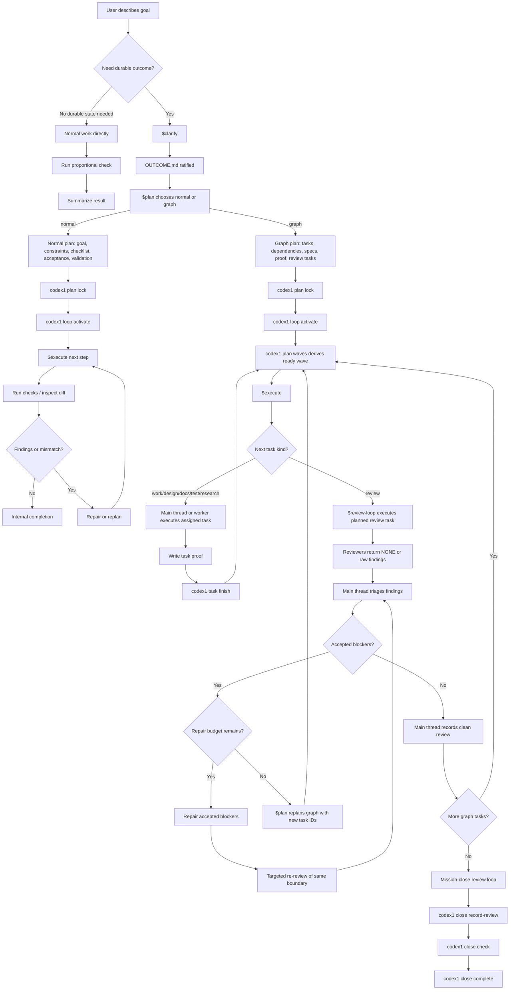
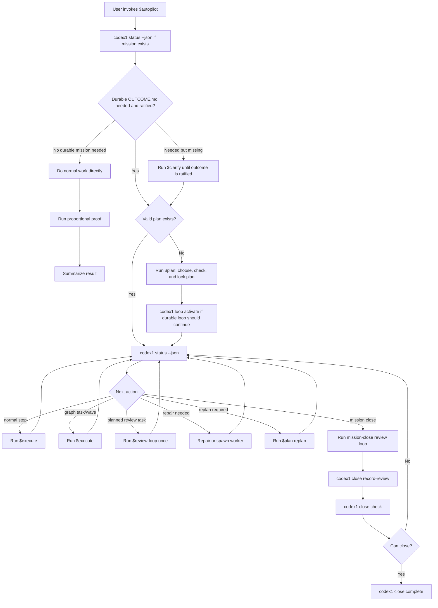
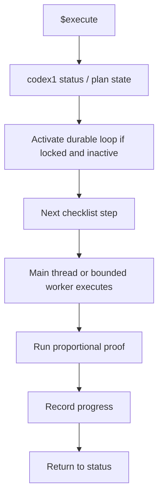
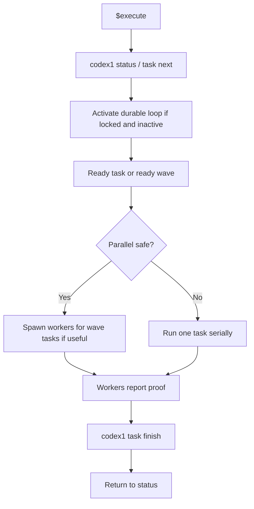
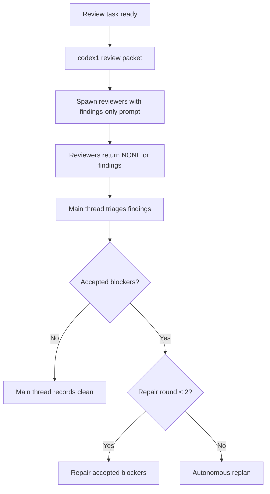
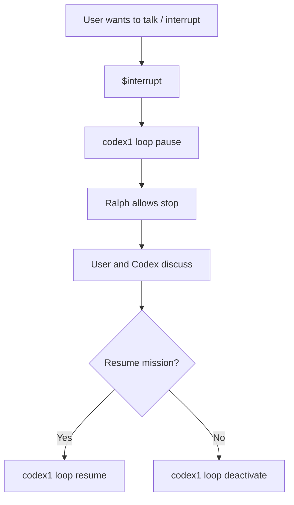
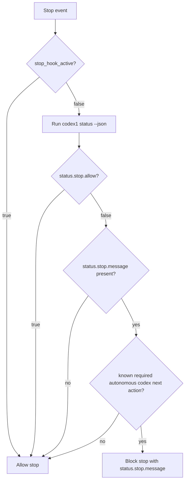

# 01 Product Flow

This file defines the user-facing workflow. A new agent should be able to implement the skills and CLI behavior from these flows without inventing extra phases.

## Skills

Codex1 exposes six public skills:

```text
$clarify
$plan
$execute
$review-loop
$interrupt
$autopilot
```

The user should think in skills, not in CLI commands.

The main Codex thread uses CLI commands behind the scenes.

There is no public `$finish` or `$complete` skill. Completion is an internal workflow/CLI state reached when the relevant checks pass.

## Planning Modes

Codex1 has two planning modes.

```text
normal = lightweight planning for ordinary work; can be chat-only or durable
graph  = explicit task graph for large/risky/multi-agent work
```

Normal mode is not a weaker version of graph mode. It is the correct mode when a checklist, acceptance criteria, and validation strategy are enough.

Graph mode is for work where dependency order, parallel delegation, review timing, stale outputs, repair boundaries, or terminal proof need machine-checkable structure.

Planning level may still express depth:

```text
light
medium
hard
```

The mode and level are related but not identical. Most normal work is `medium`. Most graph work is `hard`. A small safe task can use normal mode with `light` planning and skip durable mission state entirely.

## Manual Flow



## Autopilot Flow

`$autopilot` composes the manual flow.



`$autopilot` must pause when genuine user input is required. It must not invent
user preferences that change scope, risk, money, deployment, irreversible
external operations, or non-Git-managed destructive actions. Version-controlled
repo edits inside the locked mission scope or assigned write paths are
autonomous after mission lock, but Codex1 must not overwrite user work or
silently broaden file ownership when the safe scope is unclear.

When planning is needed, `$autopilot` may choose the lightest safe mode and level, record the decision, and escalate if risk requires it.

## `$clarify`

Purpose:

```text
Create a specified enough target to build the right thing.
```

What it does:

- Interviews the user only for uncertainty that cannot be discovered or safely inferred.
- Captures the original goal.
- Resolves ambiguity that changes product outcome, scope, risk, money, irreversible actions, account access, deployment, privacy, or security.
- Writes mission destination, must-be-true requirements, success criteria, non-goals, constraints, definitions, quality bar, proof expectations, review expectations, risks, and resolved Q&A when durable state is needed.
- Ratifies only when a future Codex thread can understand the mission without hidden chat context.

What it does not do:

- It does not ask questions for ordinary implementation details Codex can safely decide.
- It does not plan unless running inside `$autopilot`.
- It does not start a loop.
- It does not execute work.

## `$plan`

Purpose:

```text
Create the lightest plan that preserves intent and makes execution correctable.
```

What it does:

- Reads the user request or `OUTCOME.md`.
- Chooses `normal` or `graph`.
- Records `planning_mode` for durable missions.
- Records requested/effective planning level when useful.
- Escalates the effective level or mode if mission risk requires it.
- Produces architecture/design approach only as much as the task needs.
- Produces acceptance criteria and validation strategy.
- Produces a normal checklist for normal mode.
- Produces task graph, specs, proof strategy, and planned review tasks for graph mode.
- Uses the single explorer role when missing facts materially affect the plan.
- Uses advisors/critique/reviewers for graph/hard planning when useful.
- Validates with CLI before locking durable plans.
- Runs `codex1 plan lock` for durable plans once the plan is valid.

What it does not do:

- It does not execute tasks.
- It does not turn every mission into a graph.
- It does not run formal review except plan-review/critique during graph/hard planning.
- It does not store waves as truth.

## `$execute`

Purpose:

```text
Execute the next ready step, task, or wave.
```

Normal-mode flow:



Graph-mode flow:



If the next graph task is `kind: review`, `$execute` hands to `$review-loop`.

## `$review-loop`

Purpose:

```text
Compare implementation evidence against intent, then repair or finish.
```

Normal mode:

- Use a soft review loop.
- For small/local work, main thread inspection plus proportional checks are enough.
- Run tests/checks relevant to touched behavior.
- Inspect diff against the plan and acceptance criteria.
- Use a reviewer subagent only when risk, ambiguity, or blast radius justifies it.
- Repair local issues directly.
- Replan only when the plan no longer matches reality or repeated repair does not converge.

Graph planned review task mode:



Review findings should include priority and confidence using official Codex-style fields:

```json
{
  "priority": 1,
  "confidence_score": 0.82
}
```

The review event as a whole should include `overall_confidence_score`.

Mission-close mode:

```text
review -> repair/replan -> review -> repair/replan -> clean
```

For graph/large/risky missions, stop repairing a boundary after the repair
budget is exhausted and replan autonomously. The default repair budget is two
repair rounds for the same current review boundary.

Review findings are observations, not work. Only accepted blocking findings can
block progress. The canonical details are in
`07-review-repair-replan-contract.md`.

## `$interrupt`

Purpose:

```text
Pause the active loop so the user can talk without Ralph forcing continuation.
```

`$interrupt` is not mission completion.

`$interrupt` is a discussion-mode boundary. When the user invokes it, the main thread should pause the loop, answer/clarify/discuss with the user, and then resume or deactivate only after the user/main thread decides.

Commands:

```bash
codex1 loop pause --json
codex1 loop resume --json
codex1 loop deactivate --json
```

Flow:



## Ralph Flow

Ralph is minimal.

The canonical Ralph contract is in `06-ralph-stop-hook-contract.md`. If this
section and file `06` disagree, file `06` wins.

Implementation:

```text
Ralph is a Codex Stop hook.
The Stop hook runs a small codex1 hook adapter.
The adapter gets status from the same projection as codex1 status --json.
```



Tier behavior:

- No active mission: `stop.allow = true`.
- Normal mode: fail open unless there is a valid active unpaused mission with a known autonomous next action.
- Graph mode: block active unpaused loops when the next action is autonomous and safe to continue.
- `invalid_state`, missing mission, corrupt state, paused loop, unknown next action, or `stop_hook_active == true` should allow stop.

Ralph must not inspect plan/review files directly. Ralph must not manage subagents. Ralph must not use `.ralph` mission truth.

Ralph must not depend on `PreToolUse` or `PostToolUse` hooks to reconstruct mission state. Modern Codex hooks can observe MCP tools, `apply_patch`, and long-running Bash sessions; that is useful for optional append-only audit or proof capture, but not for stop authority.

For long-running Bash sessions, Ralph should rely on `codex1 status --json` to know whether the active mission wants continuation. Post-tool hooks may observe completion later, but a running process is not itself mission truth.

Only the active main/root orchestrator should feel Ralph stop pressure.
Worker/reviewer/explorer/advisor subagents should use custom role configs with
Codex hooks disabled:

```toml
[features]
codex_hooks = false
```

Do not build fake role-detection into Ralph to enforce this; keep Ralph
status-only and keep subagent behavior role-config/prompt-governed. Do not use
full-history forks for these custom-role subagents; use explicit task packets.
