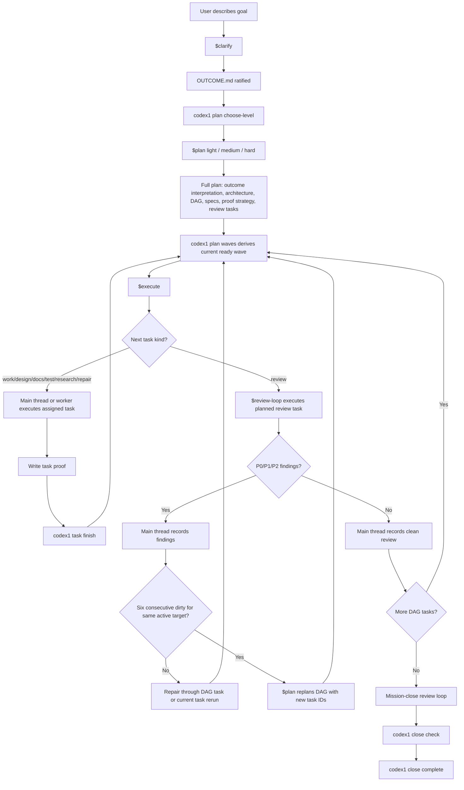
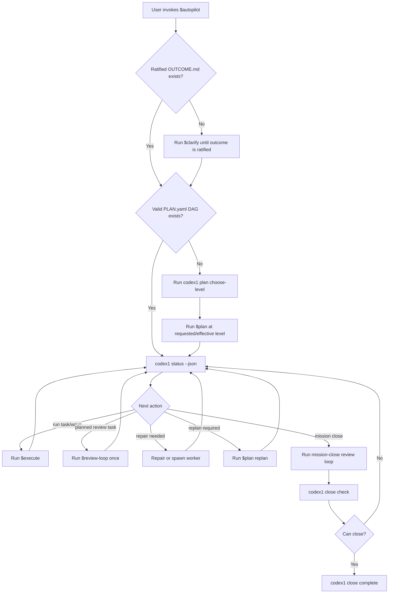
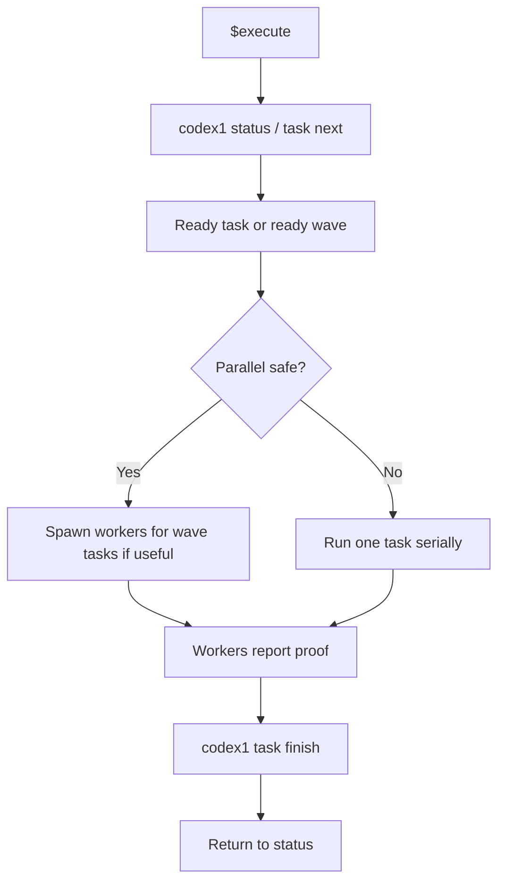
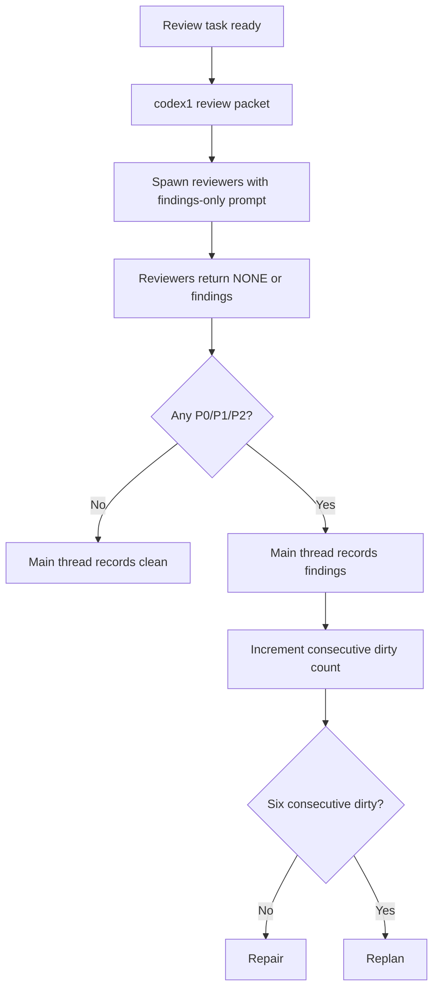
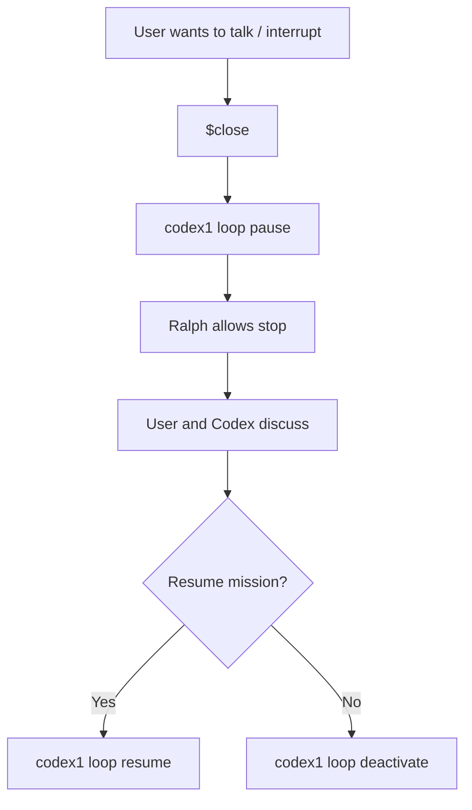
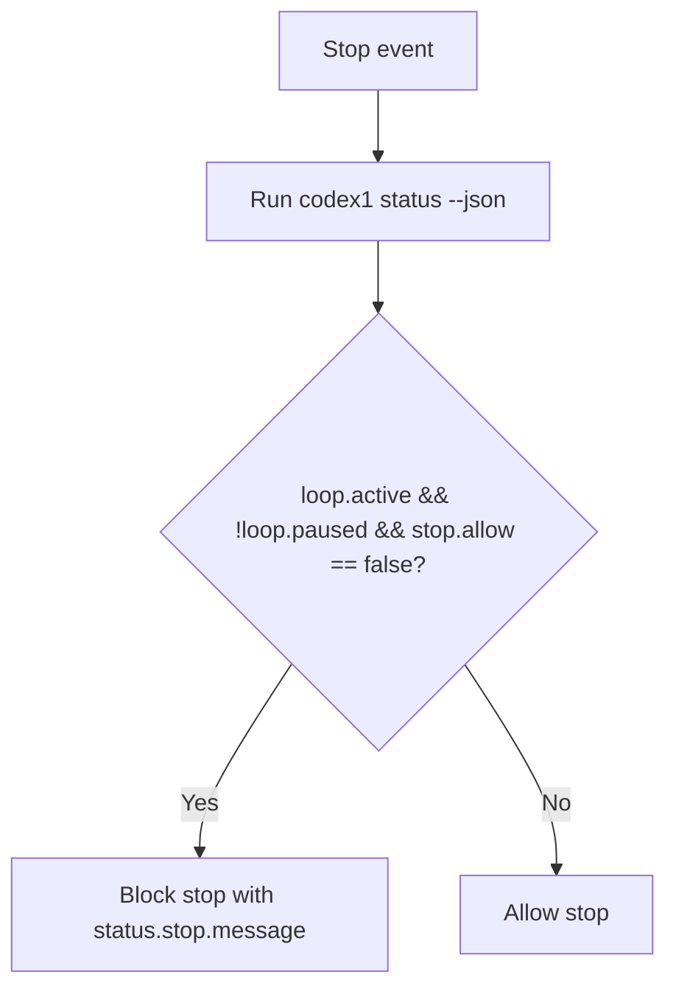

# 01 Product Flow

This file defines the user-facing workflow. A new agent should be able to implement the skills and CLI behavior from these flows without inventing extra phases.

## Skills

Codex1 exposes six public skills:

```text
$clarify
$plan
$execute
$review-loop
$close
$autopilot
```

The user should think in skills, not in CLI commands.

The main Codex thread uses CLI commands behind the scenes.

## Manual Flow



## Autopilot Flow

`$autopilot` composes the whole manual flow.



`$autopilot` must pause when genuine user input is required. It must not invent user preferences that change scope, risk, money, deployment, destructive actions, or irreversible operations.

When planning is needed, `$autopilot` should either run `codex1 plan choose-level` or use a previously recorded requested level. In a fully autonomous run, the main thread may choose the safest applicable level and record it, but it must still allow effective-level escalation when risk requires it.

## `$clarify`

Purpose:

```text
Create a fully specified OUTCOME.md.
```

What it does:

- Interviews the user.
- Captures the original goal.
- Resolves ambiguity.
- Writes mission destination, must-be-true requirements, success criteria, non-goals, constraints, definitions, quality bar, proof expectations, review expectations, risks, and resolved Q&A.
- Ratifies only when a future Codex thread can understand the mission without hidden chat context.

What it does not do:

- It does not plan unless running inside `$autopilot`.
- It does not start a loop.
- It does not execute work.

## `$plan`

Purpose:

```text
Create a full mission plan with a valid task DAG.
```

What it does:

- Reads `OUTCOME.md`.
- Runs or follows `codex1 plan choose-level`.
- Records the requested planning level.
- Escalates the effective planning level if mission risk requires it.
- Produces architecture/design approach.
- Produces task DAG in `PLAN.yaml`.
- Produces task specs.
- Produces proof strategy.
- Produces planned review tasks.
- Produces mission-close criteria.
- Uses subagents for hard planning when needed.
- Validates with CLI before locking.

What it does not do:

- It does not execute tasks.
- It does not run formal review except plan-review/critique during hard planning.
- It does not store waves as truth.

## `$execute`

Purpose:

```text
Execute the next ready task or ready wave from the DAG.
```

Flow:



If the next task is `kind: review`, `$execute` hands to `$review-loop`.

## `$review-loop`

Purpose:

```text
Orchestrate reviewer subagents and record review outcomes.
```

Planned review task mode:



Mission-close mode:

```text
review -> repair/replan -> review -> repair/replan -> clean
```

Stop after six consecutive dirty mission-close review rounds and replan.

## `$close`

Purpose:

```text
Pause the active loop so the user can talk without Ralph forcing continuation.
```

`$close` is not mission completion.

`$close` is a discussion-mode boundary. When the user invokes it, the main thread should pause the loop, answer/clarify/discuss with the user, and then resume or deactivate only after the user/main thread decides.

Commands:

```bash
codex1 loop pause --json
codex1 loop resume --json
codex1 loop deactivate --json
```

Flow:



## Ralph Flow

Ralph is tiny.



Ralph must not inspect plan/review files directly. Ralph must not manage subagents. Ralph must not use `.ralph` mission truth.

Only the active main thread should feel Ralph stop pressure. Worker/reviewer/explorer/advisor subagents should be prompted to complete their bounded job and stop normally. Do not build fake role-detection into Ralph to enforce this; keep Ralph status-only and keep subagent behavior prompt-governed.
